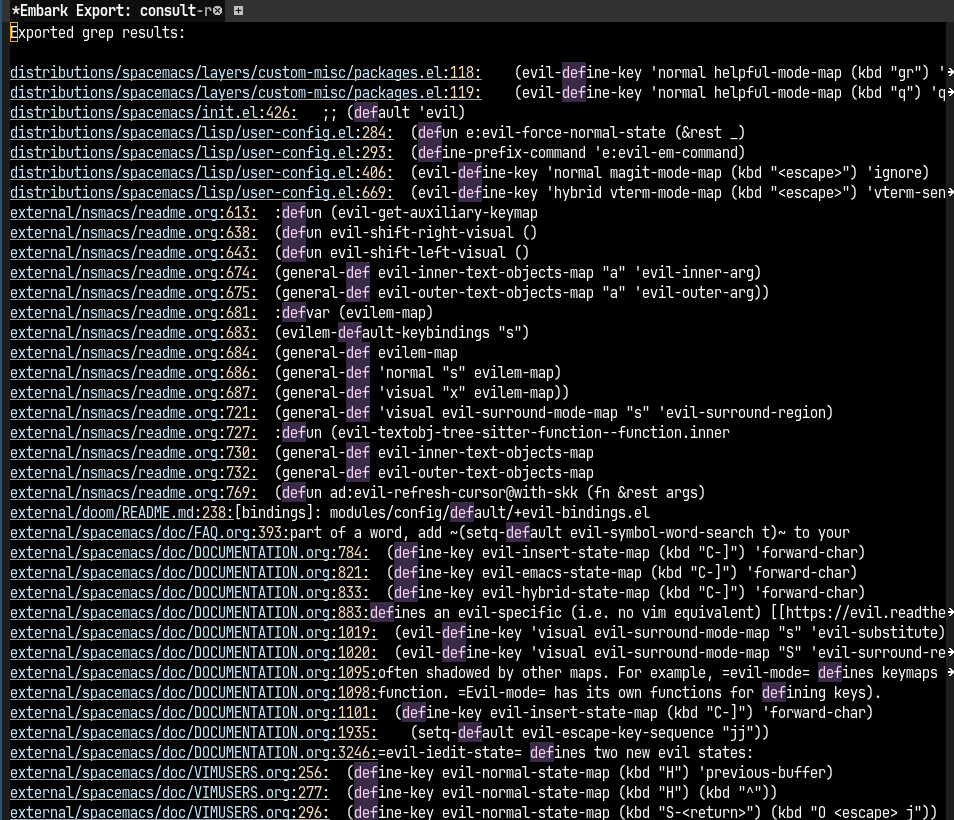

# Table of Contents

1.  [令和の Emacs](#org0dcc1ba)
    1.  [いつものトレンド](#org46920dc)
    2.  [おすすめはしない](#orgfeba6d8)
    3.  [それでもなぜEmacsを使うのか](#org5051fe4)
    4.  [令和の Emacs](#org4266956)
        1.  [パッケージ(拡張機能)の管理](#orgd666563)
        2.  [シンプルな拡張の組み合わせ](#org27a1aed)
        3.  [複雑なところは他に任せる](#orgffcf66f)
        4.  [最初から使いやすいディストリビューションも](#orgac120d3)
    5.  [Emacs での Rails 開発](#orga9b957f)
    6.  [おわり](#orgf4d437a)

# 令和の Emacs

## いつものトレンド

-   [Google Trends](https://trends.google.co.jp/trends/explore?date=all&geo=JP&q=Emacs,Vim,VSCode,RubyMine&hl=ja)
    
    

## おすすめはしない

-   基本 VSCode でいいよ
-   有料でよいなら RubyMine もいいよ
-   自分も今から始めるなら Vim を使うかも

## それでもなぜEmacsを使うのか

-   慣れている
-   極限まで自分好みにカスタマイズできる
-   なくならない(たぶん)

## 令和の Emacs

### パッケージ(拡張機能)の管理

-   [use-package](https://github.com/jwiegley/use-package) が最初から使える
-   よく使われる拡張は [MELPA](https://melpa.org/) にだいたいある
-   ない場合も簡単な設定で github.com 等から簡単にインストール可能

### シンプルな拡張の組み合わせ

たとえばよくある一括で文字列をおきかえたいケース

-   **consult + vertico:** 候補を絞り込んで表示
    
    
-   **embark(export):** 絞り込んだ候補を専用のバッファーにエクスポート
    
    
-   **grep-mode + wgrep:** 一括で編集して反映・保存
    
    

### 複雑なところは他に任せる

1.  lsp-mode

    -   [LSP Mode - LSP support for Emacs](https://emacs-lsp.github.io/lsp-mode/)

2.  copilot

    -   [copilot-emacs/copilot.el](https://github.com/copilot-emacs/copilot.el)

3.  tree-sitter

    -   Emacs 29 からは標準でサポート
    -   [emacs-tree-sitter/elisp-tree-sitter](https://github.com/emacs-tree-sitter/elisp-tree-sitter) は28以前のバージョン用
    -   tree-sitter 対応の ruby-ts-mode と、今まで通りの ruby-mode がある
        -   両方のモードの共通の継承元として ruby-base-mode がある

4.  flycheck

    -   [Flycheck - Syntax checking for GNU Emacs](https://www.flycheck.org/en/latest/)
    -   裏で各種の Linter 等を実行してエラーを表示するやつ
    -   今は標準の flymake でよいと思うが移行できてない

5.  apheleia

    -   [radian-software/apheleia](https://github.com/radian-software/apheleia)
    -   読み方はよく分からない
    -   裏側でコードをフォーマットした後に賢く差分を反映してくれる、らしい

### 最初から使いやすいディストリビューションも

-   doom, spacemacs, centaur, etc&#x2026;
-   <https://github.com/emacs-tw/awesome-emacs?tab=readme-ov-file#starter-kit>

## Emacs での Rails 開発

<table border="2" cellspacing="0" cellpadding="6" rules="groups" frame="hsides">

<colgroup>
<col  class="org-left" />

<col  class="org-left" />
</colgroup>
<tbody>
<tr>
<td class="org-left">タスク管理</td>
<td class="org-left"><a href="https://orgmode.org/ja/">Org Mode</a></td>
</tr>

<tr>
<td class="org-left">ワークスペース</td>
<td class="org-left">tab-bar-mode(標準)</td>
</tr>

<tr>
<td class="org-left">ソース管理</td>
<td class="org-left">magit</td>
</tr>

<tr>
<td class="org-left">開発</td>
<td class="org-left">projectile-rails, etc&#x2026;</td>
</tr>

<tr>
<td class="org-left">テスト</td>
<td class="org-left">rspec-mode</td>
</tr>

<tr>
<td class="org-left">環境とか</td>
<td class="org-left">vterm, prodigy</td>
</tr>
</tbody>
</table>

## おわり

